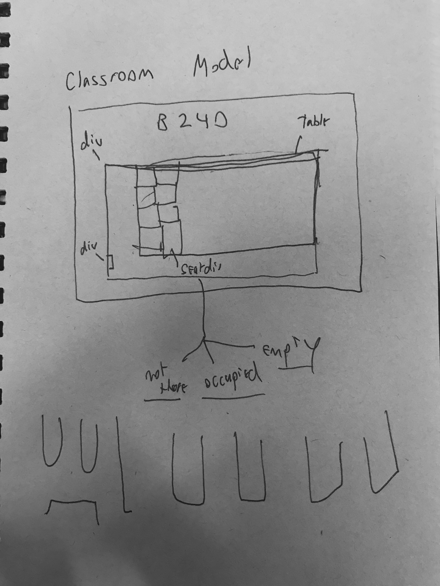

# CLAM

Computer Lab Activity Monitor for UCSD

## About

CLAM, or CLAMS, monitors student activities on UCSD CSE Basement Lab computers; it provides data on active users as well as statistics about server usage and load.

## Getting Started

This project currently consists of three teams:

- one team is working in python to extract statistics and user data from each unique lab station, and from ieng6.ucsd.edu. Code for this team is on the feature branch "python".
- The second team is working on a database to store the information collected by team one (MongoDB) and an API webserver (Node.js) to provide this information to the front-end user interface.
- The third team is working on the front-end data visualization, through use of react web components.

## Features and Architecture

- A script in Python which ssh's into each of the lab machines and checks whether someone is logged in. Writes this data to the database using PyMongo.
- A database using MongoDB which stores info on who is logged in to which computer and lab statistics.
- Web API which handles getting data about who is logged in from the database
- Front-end which renders the map of lab computers and statistics on usage.

## Notes

## Getting Started With Server

- Checkout the server branch and cd into the server directory
- To set up your own computer, install node + npm.
- Run the command "npm i"; make sure you have Python 2.7 installed.
- Install MongoDB and run "mongod" from the terminal
- Open a new terminal and run "npm start"
- Go to localhost: 3000 (or whatever port your terminal gives)
- Begin coding: <https://www.codementor.io/olatundegaruba/nodejs-restful-apis-in-10-minutes-q0sgsfhbd>

## UI Notes

Plan for the lab UI layout.

